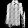

Pranav Nair

nair51@purdue.edu

https://github.com/Automage/CS390NIP-Lab4

## Resources
https://www.tensorflow.org/tutorials/generative/dcgan

## Completed
- Complete the GAN to generate legible F-MNIST records. Generate from 3 classes.
- Use a convnet for the GAN networks.
- Implement the option to select the ratio of training between discriminator and generator. (I chose to use 2 ratio hyperparameters between [0.0, 1.0], one for the generator and the other for the discriminator)
- Save a plot of loss over training steps for each network.

## Questions
### Describe the discriminator and generator.
The generator is a network responsible for generating an image from a vector of noise, the validity of which is determined by the discriminator network. The discriminator network determines whether or not an image is fake, and is used to train the generator as its loss function.

### Why do we sometimes need to train the discriminator and generator different amounts?

A balance must be found between training the discriminator and generator due to their interdependence. If the discriminator becomes too successful in detecting fake images before the generator is adequately trained, the generator will be unable to learn as all of its images are classified as fake. If the discriminator is not adequately trained, the generated images may be classified as 'not fake' too generously, causing the generator to generate less real looking images. Therefore, a fine balance must be maintained such that the discriminator and generator are trained together symbiotically.

## Hyperparameters
epochs = 2000 

optimizer = Adam

adversarial loss function = binary cross entropy

generator training ratio = 1.0

adversarial training ratio = 1.0

## Plots

### F_MINST Coat

### F_MINST Sneaker

### F_MINST Trouser

## Images

### F_MINST Coat

### F_MINST Sneaker

### F_MINST Trouser

